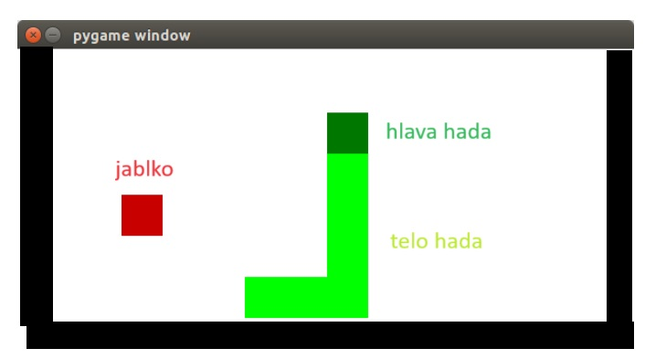
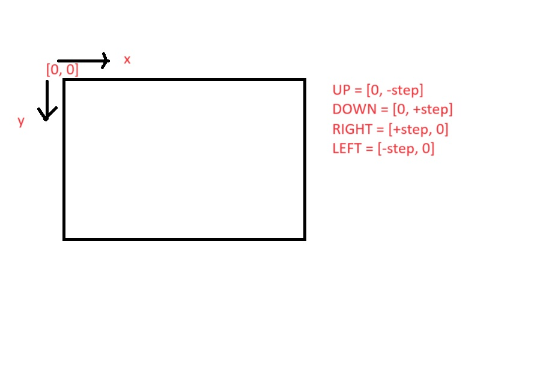
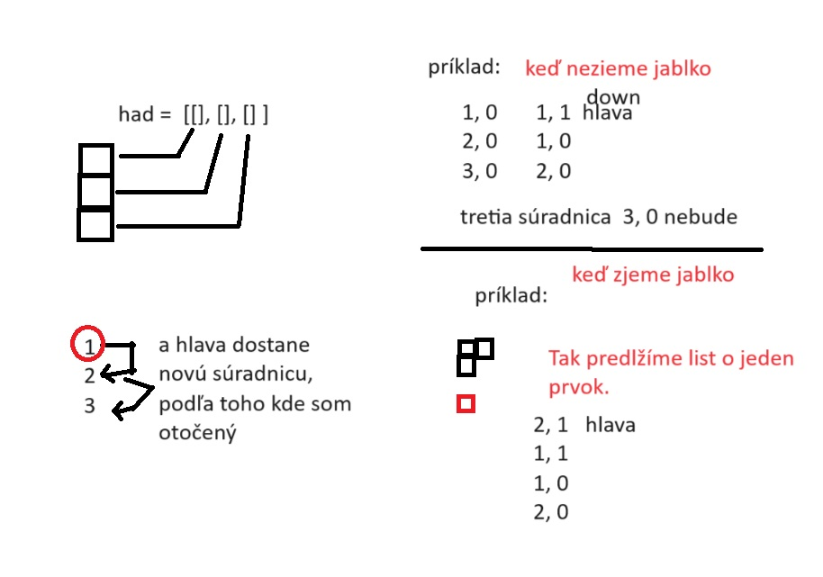

# HRA  SNAKE /HAD 

Je to veľmi známa a stará hra. Po obrazovke sa pohybuje najprv hlavička hadíka, ktorú ovládame pomocou smerových šípiek.
(HORE, DOLE, VĽAVO, VPRAVO). Na obrazovke sa náhodne generuje jablko. Úlohou hrača je naviesť hlavičku hadíka tak, aby narazila do jablka. Ak sa to podarí, vznikne kolízia a hlavička hadíka sa zväčši o jeden článok. Hra končí, ak sa hlavička hada dostane mimo obrazovku alebo had prejde po svojom tele.

## Požadované vedomosti

    1)  Zvládnutý základný kurz Pythonu
    2)  Modul random
    3)  Modul pygame - základy

## Postup riešenia

Tento repozitár pygame_snake obshuje tzv. commity. Začnite si prezerať commity od spodu smerom na hor. Pre lepšiu názornosť sú aj očíslované. Commity sú výstižne pomenované, aby ste vedeli, čo sme v nich riešili.

## Pomocné obrázky

## Funkcie v kóde main.py
Všetky funckie majú anglické pomenovania + parametre (deto). Pri volaní jednotlivých funkcii používame slovenské parametre, aby sme rozlišili tzv. lokálne a globálne premenné.

